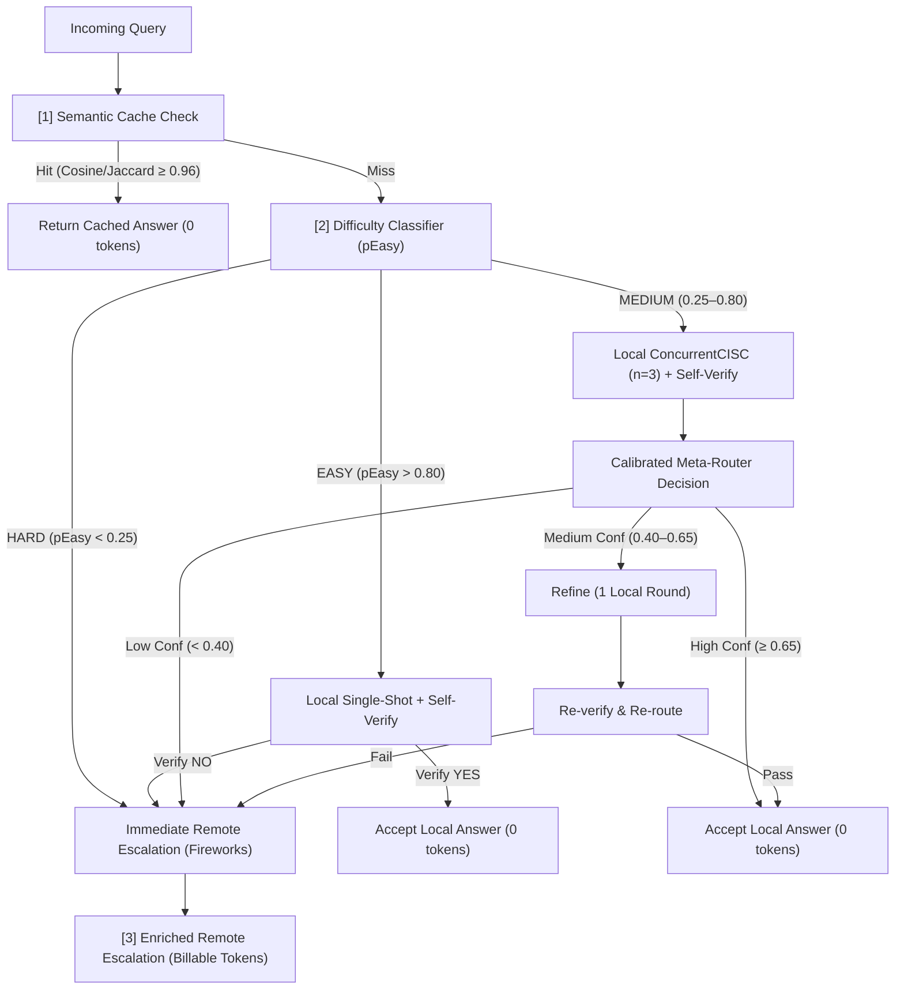

# Free-Verify Cascade 🚀

[](https://lablab.ai/ai-hackathons/amd-developer-hackathon-act-ii)
[-orange?style=flat-square)](https://lablab.ai/ai-hackathons/amd-developer-hackathon-act-ii)
[](https://nextjs.org/)
[](https://bun.sh/)
[](https://caddyserver.com/)

**Free-Verify Cascade** is a hybrid, token-efficient LLM routing system built for the **AMD Developer Hackathon: Act II (Track 1 — AI Agents & Agentic Workflows)**. 

The core thesis of this architecture is to minimize expensive remote model calls by routing queries through a **free, local model (Gemma 3 4B running on AMD Instinct MI300X)** when confident, and escalating to a **paid, remote model (Gemma 3 27B on Fireworks AI)** only when necessary. The routing decision is made dynamically by a calibrated meta-router using a 6-feature classifier.

---

## 📐 Architecture Overview

The system uses a 3-tier cascaded pipeline to determine the best response path for any query, balancing speed, token cost (remote tokens = paid; local tokens = free), and output accuracy.



### Key Components

1. **Semantic Cache**: Uses token-set Jaccard similarity (proxy for FAISS cosine) to match incoming queries. Hits (similarity $\ge 0.96$) are served instantly at $0$ cost.
2. **Difficulty Classifier**: Evaluates linguistic signals (length, verbs, conditional clauses, etc.) to compute a difficulty score ($pEasy$).
3. **ConcurrentCISC ($n=3$)**: Runs three parallel samplings in a single vLLM forward pass, calculating consensus agreement through Levenshtein & Jaccard distance metrics.
4. **Self-Verification**: Runs a lightweight local YES/NO validation prompt on the output.
5. **Calibrated Meta-Classifier**: A logistic regression model trained on 6 features: $pEasy$, agreement, selfVerify, answer length ratio, judge score, and refinement state.
6. **Enriched Remote Escalation**: Formulates a prefix-stable prompt for Fireworks AI, allowing the remote model to benefit from a 50% prefix-cache discount while receiving the local model's failed outputs as context.

---

## 📂 Project Structure

```
├── .dockerignore           # Excludes development bloat from Docker context
├── Dockerfile              # Multi-stage build (Builder: Bun -> Runner: Bun + Caddy + OpenSSL)
├── docker-compose.yml      # Orchestrates the application with SQLite volumes
├── docker-entrypoint.sh    # Automates DB initialization and starts Next.js + Caddy
├── Caddyfile               # Configures reverse proxy with dynamic XTransformPort routing
├── package.json            # Scripts & dependencies (Next.js, Prisma, Tailwind, etc.)
├── prisma/
│   └── schema.prisma       # Database schema (SemanticCache, ShadowTelemetry, AblationRun, etc.)
├── src/
│   ├── app/
│   │   └── api/cascade/    # Backend routes (solve, train, telemetry, health, stats, cache)
│   ├── components/cascade/ # UI components (Overview dashboard, Sandbox, Ablation Pareto charts)
│   └── lib/cascade/        # Core pipeline, meta-router, stubs, and model clients
└── scripts/
    ├── tune-peasy.ts       # Optimizes pEasy weights via local validation run
    └── clear-ablation.ts   # Resets SQLite telemetry tables
```

---

## ⚙️ Running Modes

The system operates in two modes, toggled via the `SIMULATE_LOCAL` environment variable in your `.env` or `.env.local` files:

### 1. Simulation Mode (`SIMULATE_LOCAL=true` - Default)
- **Local & Remote Tiers**: Redirected to the `z-ai` SDK (calling GLM-4.6).
- **Tokens & Costs**: Estimated based on characters (4 chars/token).
- **Use Case**: Used for UI/UX demonstration, prototyping, and testing dashboard controls without consuming active API keys or running local GPU containers.

### 2. Production Mode (`SIMULATE_LOCAL=false`)
- **Local Tier**: Calls a local vLLM endpoint (`VLLM_BASE_URL`).
- **Remote Tier**: Calls the official Fireworks AI API (`FIREWORKS_API_KEY`) using the selected Gemma models.
- **Tokens & Costs**: Real billable token usage fetched directly from API usage payloads (including Fireworks prefix-cache discounts).
- **Use Case**: Used in the hackathon scoring environment.

---

## 🚀 Quick Start (Local Development)

### Prerequisites
- Install [Bun](https://bun.sh/)
- (Optional) [Docker Desktop](https://www.docker.com/products/docker-desktop/) if running containerized.

### Setup Steps
1. **Clone the repository** and install dependencies:
   ```bash
   bun install
   ```
2. **Setup environment variables**:
   Create a `.env` file in the root directory (see `.env.example` for details):
   ```env
   DATABASE_URL=file:./db/custom.db
   SIMULATE_LOCAL=true
   FIREWORKS_API_KEY=your_fireworks_key_here
   ```
3. **Initialize the SQLite database**:
   ```bash
   bun run db:generate
   bun run db:push
   ```
4. **Run the development server**:
   ```bash
   bun run dev
   ```
   Open [http://localhost:3000](http://localhost:3000) to view the interactive control panel.

---

## 🐳 Running with Docker

We provide a complete Docker wrapper that runs both the Next.js standalone application and the Caddy reverse proxy inside the same network namespace. The SQLite database is mounted to a local volume to ensure persistence.

1. **Start Docker Desktop**.
2. **Launch the stack**:
   ```bash
   docker compose up -d --build
   ```
3. **Access the application**:
   - **Caddy Reverse Proxy (Production Gateway)**: [http://localhost:8080](http://localhost:8080)
   - **Next.js Standalone (Direct API)**: [http://localhost:3000](http://localhost:3000)

The database will be persisted locally at `./db/custom.db`.

---

## 📊 Tuning & Evaluation

### Tuning pEasy Classifier
To optimize the heuristic weights of the difficulty classifier, run the validation tuner script in production mode:
```bash
bun run scripts/tune-peasy.ts
```
Paste the output weights JSON into `src/lib/cascade/difficulty.ts`.

### Training the Meta-Router
Train the dynamic meta-classifier on the seed dataset by sending a POST request to:
```bash
curl -X POST http://localhost:3000/api/cascade/train
```
*(Or click the **Re-train Meta-Router** button on the UI Status panel)*.

---

## 🏆 Hackathon Submission Checklist (Track 1)

Before submitting to lablab.ai, verify that the following items are complete:
- [x] Docker containerization is set up (via `Dockerfile` and `docker-compose.yml`).
- [x] SQLite database mounts are tested and persistent.
- [x] Environment files (`.env.example`) contain placeholders for required model configurations.
- [ ] Swapped mock keys with active production keys during final deploy.
- [ ] Confirmed the repository is set to **Public** on GitHub.
- [ ] Recorded a 2-3 minute demo video showcasing the Next.js Dashboard and the Routing Sandbox.
- [ ] Exported the slide deck as a PDF for upload.
